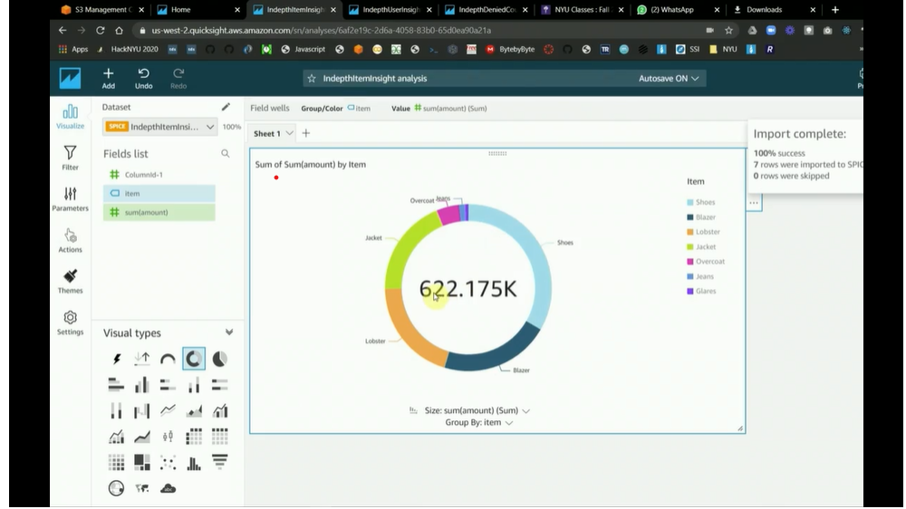

# Credit-Card-fraud-detection-and-billing-using-Kafka

We had studied indepth about Kafka, Elastic and Spark to establish two data pipeline with several small demos. The first pipeline is ELK stack for processing and visualizing logs in a scalable way. 

## Part 1: Setting up my ELK stack (Elastic Search, Logstash, Kibana)

Installed ELK stack into an **EC2 instance** and built a log processing using Apache logs to connect into ELK stack and created a couple visualization graph to show in **Kibana**. **Logstash** visualization is shown for Apache logs generated per country, by city, city cloud, per time. 

--------------------------------------------------------------------------------------------------------------------------------------------------------------------

## Part 2: Kafka and Spark Setup

We have installed kafka and connect a producer and consumer in EC2 instances. We defined a use case to build the data pipeline that will connect as follows:

source --> **Apache Kafka** --> consumer --> **spark EMR** streams 

Created a producer and a consumer and created messages for a topic and let consumer get the messages and then activate a script. 

### Producer

### Consumer

-----------------------------------------------------------------------------------------------------------------------------------------------------

## Part 3: Final Data Pipeline: Credit Card fraud detection and billing 

Built the **data pipeline** to process credit card transactions in realtime to classify if fraudulent or authentic (based on user's buying pattern) and approve or deny the transaction. For the approved transaction, we batched the transaction details and created a billing statement at monthly time scale. 

We have a producer and consumer which is subscribed to kafka topics which has transactions related data. 

We created two types of events - transaction approval request and actual transaction with details once approved. 
We created two topics - 
* Topic1: one for approval request and 
* Topic2: one for transaction details. 

The Topic 1 is ingested by kafka --> spark streams --> Listener 1. Listner 1 triggers a **Lambda** function to determine if it is fraud or not based on user buying profile. We had written a simple pyspark EMR function that just checks the user profile (buying place, amount of purchase) and if any anomaly, it sends a reject message to another topic in kafka. If approved, then approved message to the same topic. 

Topic 2: for every approved transaction, the Point of sale (where the purchase being made) sends the detailed purchase (item, amount, time etc) to topic 2. This is ingested by spark that does ETL and saves the message in a database like dynamo or RDS for processing later on to generate monthly billing statement. 

### Scalability:
In order to have a realworld kinda scalable analysis, we initially created a simulator to simulate at least 100 users and created a series of transaction requests to demonstrate this. This is stored in **s3 buckets** and using Amazon QuickSight Analysis, we had built a small dashboard to plot the events/topics to show which one rejected and which one approved and billing statement.

## Project Demo

